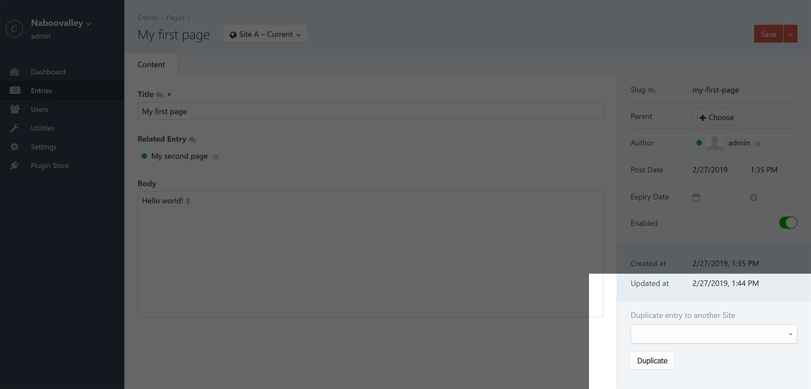
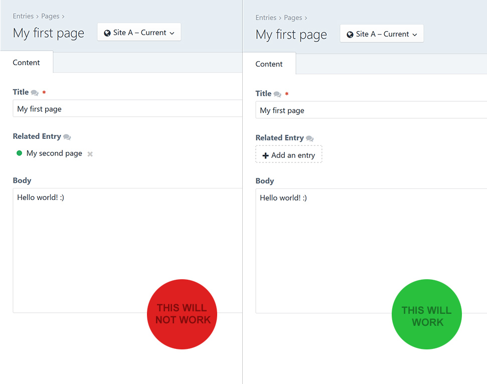

# Site Duplicate plugin for Craft CMS 3.x

Site Duplicate let's you duplicate entries across Sites in Craft CMS. It even works when section entries aren't set to *propagate across site sections* making it easy to duplicate entry data between Sites.

## Contents

- [License](#license)
- [Requirements](#installation)
- [Installation](#installation)
- [How It Works](#how-it-works)
- [Known limitations](#known-limitations)
- [Credits](#credits)

## License

This plugin is licensed for free under the MIT License. Please see the LICENSE file for details.

## Requirements

This plugin requires Craft CMS 3.0.0 or later.

## Installation

To install Site Duplicate, follow these steps:

1. Install with Composer via `composer require naboo/craft-siteduplicate`
2. Install plugin in the Craft Control Panel under Settings > Plugins

You can also install Site Duplicate via the **Plugin Store** in the Craft Control Panel.

## How It Works

The plugin enables you to add a sidebar widget to selected sections for which you would like to be able to duplicate entries across Sites. The widget will display available Sites for the current section. 

> **Notice!** Some limitations need to be kept in mind - please see the [Known limitations](#known-limitations) section for more info.

### Issues

Please report any bugs/issues you find to the [Issues](https://github.com/naboo/craft-siteduplicate/issues) page.

## Known limitations

There are some things to keep in mind when duplicating entries across Site sections. 

Here's a list of known limitations - and potential workarounds - to keep in mind before duplicating.

### 1. Issues with element relations

If the Site you are duplicating to is set to not have its entries *propagated scross site sections* the Site might not be able to have the same type of relations as the Site you are duplicating from. 

For example you might want to duplicate an entry from **Site A** which has an *Entries* relations field. The field might have a relation to another entry in **Site A**. When duplicating the entry to **Site B** the relation isn't available in **Site B** since the related entry exists only in **Site A** (this goes for all relations, entries, assets, categories...). This will cause Craft to throw a *validation error* when duplicating the entry, leaving the duplicated entry in Site A.

But there is a workaround. Before duplicating the entry from **Site A** you can remove/disable the relation since the plugin will actually duplicate what's on the screen - not what's in the database. So let's say you want to duplicate an entry that has a relation - before duplicating the entry you'll just remove/disable the relation (only on screen - you don't need to save the entry in **Site A**) like this:

... then you duplicate the entry and Craft will be able to duplicate the entry data to another Site.

### 2. Parent entries (structures) aren't supported when duplicating

Another limitation is that all entries being duplicated will always duplicate to the root level of the section. So if the section you are duplicating within is a Structure and sits at level 2 in **Site A** the duplicated entry will always duplicate to the root level in **Site B**. This is to prevent Craft from throwing errors if the section hasn't the same entry setup between Sites. It's almost the same logic as the limitation with relations. If the relation isn't there - it can't be duplicated.

## Credits

Brought to you by [Johan Strömqvist](http://www.naboovalley.com)

Big thanks to Pixel&Tonic for making an amazing CMS. Site Duplicate also uses a lot of code from Craft core.